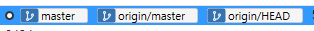

# 2022 OSS 수요일 오전반 6조 

## 팀 과제 : Git 교과서 5장 정리하기


  
<center></center>


## 5장 서버
1. [서버 저장소](#서버-저장소)
2. [깃허브 서버 준비](#깃허브-서버-준비)
3. [깃허브 연동 및 원격 등록](#깃허브-연동-및-원격-등록)
4. [서버 전송](#서버-전송)
5. [자동으로 내려 받기](#자동으로-내려-받기)
6. [수동으로 내려 받기](#수동으로-내려-받기)
7. [순서](#순서)

## 서버 저장소

서버 저장소는 다른 말로 원격(remote) 저장소라고도 합니다.
- 5.1.1 협업 저장소

    - 깃은 여러 개발자와 협업하려고 탄생한 도구입니다. 인터넷에 연결하여 작업할 수 없는 개발환경도 많이 있기때문에 이 두 가지 환경을 고려하여 분산형 모델을 선택했습니다.

- 5.1.2 연속된 작업
  - 서버 저장소는 여러 컴퓨터에 동일한 깃 저장소를 복제하고, 작업한 결과물을 다시 서버로 통합합니다.

- 5.1.3 새 멤버
    - 새 멤버가 추가 되어도 깃은 깃의 원격 저장소 주소만 알려 주면 모두 해결됩니다.

## 깃허브 서버 준비
독립적인 깃 서버를 직접 운영하여 사용할 수 있습니다. 하지만 365일 안정적인 서버를 운영하는 것은 쉽지 않습니다. 직접 서버를 운영하지 않아도 전문적인 깃 호스팅으로 서버를 대체할 수 있습니다. 호스팅을 받으면 직접 서버를 관리하지 않아도 쉽게 원격 저장소를 운영할 수 있습니다.

- 5.2.1 깃허브

    - 깃허브는 대표적인 깃호스팅 서비스입니다. 깃허브의 모든 서비스는 무료로 사용할 수 있습니다. 서비스를 사용하려면 먼저 회원 가입이 필요합니다. 회원 가입을 하려면 이메일 주소가 필요합니다. 사용자 이름은 영문으로 작성하며, 저장소를 구별하는 주소 값으로 사용합니다. 일반적으로 개별 깃허브 주소는 다음과 같이 표현합니다.  ```"https://github.com/사용자이름"``` 

- 5.2.2 저장소 생성
  - 한 소유자 안에서 같은 저장소 이름은 중복하여 생성할 수 없습니다.


## 깃허브 연동 및 원격 등록
깃허브에 새 저장소를 생성했다면 이제 로컬 저장소와 연결해야 합니다. 기존 로컬 저장소와 연결하거나 새 로컬 저장소를 생성하여 연결할 수도 있습니다.

- 5.3.1 로컬 저장소
    - (깃허브에 new repository생성 후)   
    ```git init``` 명령어로 깃을 초기화한 다음저장소의 소개페이지 파일을 생성합니다.  
        ```
        $ echo "# gitstudy" >> README.md -- 파일생성  
        $ git add README.md 
        $ git commit -m "first commit"
        ```
   

- 5.3.2 프로토콜
  - 서버와 통신하려면 프로토콜을 사용해야 합니다. 깃은 기본적으로 Local, HTTP, SSH, Git 네 종류의 전송 방식을 지원합니다.
  - Local(로컬)  
  로컬 컴퓨터에 원격 저장소를 생성하는것을 의미합니다.자신의 컴퓨터를 NFS(Network File System)등 서버로 이용할때 편리합니다. 로컬저장소를 서버로 이용할때는 폴더경로만 입력합니다.   
  ```$ git remote add 원격저장소별칭 폴더경로```   
  로컬은 간단한 원격서버 구축이 가능하고 빠른 동작이 가능하나 모든 자료가 자신의 컴퓨터에 집중되는 위험이 있습니다.
  - HTTP  
  서버에 접속하려면 로그인 절차가 필요합니다. HTTP는 익명 혹은 계정을 이용하여 처리할 수 있습니다.
  - SSH  
  깃에서 권장하는 프로토콜로, 높은 수준의 보안통신으로 처리하기 때문에 깃서버를 더 안전하게 운영할 수 있습니다. 'ssh://계정@주소'처럼 프로토콜 타입을 지정해야합니다. 인증서를 만들어 사용하며 인증서 이용 시 별도의 로그인 절차가 없어도 됩니다. 인증서는 공개키와 개인키로 구분되며 공개키는 서버에 등록하며 개인키는 로컬에 저장합니다. HTTP와는 달리 익명으로 접속할 수 없습니다.
  - GIT  
  SSH와 유사하지만 인증 시스템이 없어 보안에 취약할 수 있습니다. 잘 사용되지 않습니다.

- 5.3.3 원격 저장소의 리모트 목록 관리
    - ```remote``` 명령어를 통해 원격저장소(서버)를 관리할 수 있으며, 원격저장소 목록 확인, 등록 및 취소 작업을 할 수 있습니다.  
        ```
        $ git remote --- 연결된 원격 저장소의 이름(별칭)을 출력
        $ git remote -v --- 이름(별칭)과 URL 확인
        ```  
        깃은 복수의 원격저장소를 연결할 수 있으며 리모트 저장소가 여러개있다면 목록을 모두 출력하지만, 저장소의 권한정보는 확인할 수 없습니다.

- 5.3.4 주소와 별칭
    - 별칭 : 긴 주소 대신 별칭을 사용할 수 있음
    - origin : 대표적으로 사용하는 별칭, 목적에 따라 다른 이름도 가능

- 5.3.5 원격 저장소에 연결
    - ```add``` 옵션을 사용하여 로컬과 원격 저장소를 연결할 수 있습니다.    
        ```
        $ git remote add 원격저장소별칭 원격저장소URL
        $ git remote add origin https://github.com/deveq/gitstudy.git
        $ git remote -v
        origin https://github.com/deveq/gitstudy.git (fetch) 
        origin https://github.com/deveq/gitstudy.git (push)
        ```
        push는 서버로 전송하는 동작, fetch는 서버에서 가져오는 동작을 의미합니다.    

- 5.3.6 소스트리에서 원격 브랜치      

      

    -master : 현재 로컬 저장소 
    origin/master(별칭/브랜치) : 원격저장소의 브랜치   

    로컬 저장소와 서버 저장소를 구분하여 표시하므로 서로 동기화한 시점을 판별할 수 있습니다.

- 5.3.7 별칭 이름 변경과 정보
    - ```rename``` 옵션을 이용해 별칭을 변경할 수 있습니다.    

        ``` 
        --- 별칭 변경  
        $ git remote rename 변경전 변경후 
        --- 원격 저장소의 상세 정보 
        $ git remote show 별칭
        ```

- 5.3.8 원격 저장소 삭제
    - 로컬 저장소는 복수의 원격저장소와 연결가능합니다. 깃을 하다보면 풀 리퀘스트(pull request), 테스트 등의 목적으로 임시 등록된 원격 저장소들도 있습니다. 등록된 원격저장소는 ```rm``` 옵션으로 삭제할 수 있습니다.  
    ```$ git remote rm 별칭``` 


## 서버 전송

- 5.4.1 Push : 서버 전송
  - push명령어를 통해 원격 저장소로 커밋된 파일들을 업로드 할 수 있습니다.
    ```
    $ git push 별칭 브랜치이름
    $ git push origin master
    ```
    별칭 이름을 가지는 서버의 master브랜치에 현재 브랜치를 업로드합니다.


## 자동으로 내려 받기

- 5.5.1 clone : 복제
  - ```clone``` 명령어를 이용해 복제를 할 수 있습니다. clone명령어를 사용하면 초기화(init)과 원격 서버 접속에 필요한 추가 설정을 자동으로 수행합니다.
- 5.5.2 pull : 서버에서 내려받기  
  - ```pull``` 명령어를 사용해 원격 저장소의 갱신된 내용을 추가로 내려받을 수 있습니다.
    ```
    $ git pull
    ```
    원본 저장소에 파일을 추가 후 commit, push를 진행하고 복제한 저장소로 이동한 후 ```$ git pull``` 명령어를 실행하면 서버는 원격저장소와 로컬저장소를 비교하여 갱신합니다.

## 수동으로 내려 받기

- 5.6.1 자동병합
  - ```pull``` 은 원격서버에 현재 커밋보다 최신 커밋정보가 있을 경우 내려받습니다. 내려받은 커밋정보는 임시영역에 저장합니다. 스테이지가 아닌 원격저장소를 위한 전용 임시 브랜치가 있습니다. 내려받은 최신커밋을 현재 브랜치로 자동병합하지만 충돌이 발생할 경우도 있습니다. 이러한 경우 fetch명령어를 사용해야합니다.     
- 5.6.2 fetch : 가져오기  
  - ```fetch``` 는 원격 저장소의 코드를 수동으로 내려받는 작업을 하며, 내려받아도 현재 브랜치와 자동병합하지 않습니다.
    ```
    $ git fetch 원격저장소URL
    ```
    원본 저장소에 파일 수정 -> 원격서버에 push -> 클론 저장소 -> git fetch -> git log (변경없음)  
   pull명령어와는 달리 fetch 명령어 실행 후 커밋이 추가되지 않고 변경도 없습니다.
   fetch는 원격저장소의 커밋들만 가지고 왔을 뿐 로컬 저장소에서 어떤 작업도 하지 않습니다.  
   (수동 병합인 fetch동작을 하면 새로운 master브랜치를 하나 더 생성하며 서버/master형태의 임시브랜치가 생성됩니다.임시브랜치에서는 커밋할 수 없습니다.)
- 5.6.3 merge 명령어로 수동 병합
  - ```fetch```는 데이터를 내려받을 뿐 자동병합하지 않습니다. 내려받은 커밋을 로컬저장소에 적용하려면 ```merge```명령어를 사용하여 병합명령을 실행해야합니다.
    ```
    $ git merge 원격저장소별칭/브랜치이름  
    $ git merge origin/master
    ```

## 순서
원격 저장소에는 다수의 개발자가 동시에 커밋을 푸시할 수 없으므로 여러명이 협업할때는 순차적으로 푸시해야합니다.
- 5.7.1 최신상태
  - 원격저장소에 푸시하려면 자신의 로컬저장소를 최신상태로 유지해야하며 최신이 아닐경우 push할 수 없습니다.
- 5.7.2 충돌방지
  - 깃이 최신상태의 푸시만 허용하는것은 충돌을 방지하기위함입니다. 원격저장소의 커밋을 내려받는 풀 작업은 내려받은 커밋들을 현재 브랜치로 자동병합합니다. 이때 커밋내용이 순차적이지 않으면 병합과정에서 충돌이 발생합니다.  

    개발자 1,2가 서로 다른 작업을 했다면 충돌이 없을수도 있지만, 같은 영역을 동시에 수정했다면, 개발자2가 풀작업을 할때 무조건 충돌이 발생합니다. 개발자 2는 충돌을 해결한 후 커밋하고 푸시해야하는데, 이를 해결하기가 어렵습니다. 따라서 깃은 이를 더 쉽게 해결할 수 있도록 푸시할 때 커밋의 순차적 기록을 확인합니다.

    충돌을 최대한 피하는 방법은 자신의 저장소와 원격저장소의 상태를 자주 최신으로 유지하는것입니다.  

    pull - coding -> commit -> pull -> push

    (인증정보 캐시 깃허브,비트버킷과 같은 호스팅 원격 저장소 이용 시 id, pw가 있어야하는데, 매번 입력하기 귀찮으므로 깃은 인증정보캐시(credential cache)기능을 이용하여 id,pw를 임시로 보관할 수 있습니다. 이 기능을 활성화하기 위해서는 아래와 같은 설정이 필요합니다.)  
    ```
    $ git config --global credential.helper cache
    ```
