# 2022 OSS 수요일 오전반 6조 

## 팀 과제 : Git 교과서 8장 정리하기

  

## 8장 병합과 충돌
1. [병합](#병합)
2. [Fast-Forward](#Fast-Forward)
3. [-way 병합](#-way-병합)
4. [브랜치 삭제](#브랜-삭제)
5. [충돌](#충돌)
6. [브랜치 병합 여부 확인](#브랜치-병합-여부-확인)
7. [리베이스](#리베이스)
8. [정리](#정리)

## 병합

깃은 언제든지 새로운 작업을 할 수 있는 브랜치를 만들 수 있습니다. 브랜치로 분기하여 코드를 수정했다면 언젠가는 원본에 다시 변경된 코드를 적용해야 하는데 이런 독립된 브랜치를 한 브랜치로 합치는 작업을 병합이라 한다. 

- 8.1.1 연속된 작업
    - 여러 개발자와 코드를 공유하면서 변경된 소스를 수동으로 병합하는것은 매우 어려움.

- 8.1.2 깃으로 자동 병합
    - 깃은 원본 기준으로 두 파일의 변경 이력을 비교하여 병합.
    - 깃이 모든 코드의 병합을 완벽하게 처리할 순 없음.

## Fast-Forward

순차적 커밋에 맞추어 병합을 처리하는 방식
일반적으로 혼자 개발할 때 사용
브랜치 경로가 일직선 모양일 때 병합 작업을 하면, Fast-Foword 방식의 알고리즘이 적용 (소스트리 모양)

- 8.2.2 병합 위치
    - merge 명령어
        -  
        - merge 명령어는 현재 브랜치를 기준으로 다른 브랜치의 모든 커밋을 병합

- 8.2.3 Fast-Forward 병합 적용
    - 
    - 병합 방식 알고리즘 확인 가능
    - 
    - before
    - 
    - after
        - 병합 후엔 feature 의 마지막 커밋위치와 master의 마지막 커밋위치가 같아짐
        - 원본에 추가된 내용이 없다면, 변경한 파일을 대체하는 것과 같음.

## -way 병합

여러 개발자와 협업으로 작업하는 경우 사용

- 8.3.3 공통 조상
    - 
    - 두 브랜치를 병합하려면 공통 커밋을 찾아야 함.
    - 공통 조상 커밋을 포함하는 브랜치와 새로운 두 브랜치, 3개를 하나로 병합해야 하기  때문에 이를 3-way 병합이라고 함.
    - 깃을 공통 조상 커밋을 자동으로 찾아 줌.

- 8.3.4 병합 커밋
    - 3-way 병합은 성공적으로 병합을 완료한 뒤, 새로운 커밋을 추가로 하나 생성
    - 병합 커밋이라고 부름
    - 병합 커밋은 부모 커밋이 2개
    - 

- 8.3.5 병합 메시지
    - 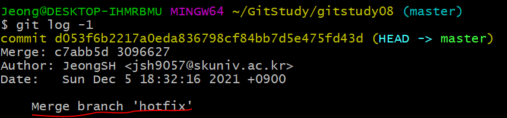
    - 3-way 병합은 Fast-Forward 병합과 달리 병합 메시지가 필요.
    - 3-way 병합은 병합 후 자동으로 커밋 메시지를 생성.
- 병합 할 때, 직접 커밋 메시지를 작성 할 수 있음.
    - 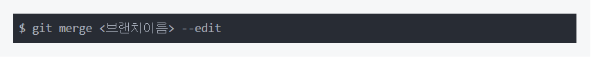

## 브랜치 삭제

일반적인 병합한 이후에는 병합된 브랜치를 삭제함.

깃 플로
깃 플로는 브랜치 작업을 규격화 해서 쉽게 다루기 위한 전략
깃 플로의 기본 브랜치에는 master, featyre, develop, release, hotfix 브랜치가 있습니다.
이 중 develop 브랜치는 master 브랜치에 병합한 후에도 삭제하지않고 유지,
이처럼 오래 유지하는 브랜치를 long-running 브랜치라고 함.
- 깃플로 기본 브랜치
    - master brach :  실제로 운영, 배포되어 사용자가 사용하게 될 코드가 있는 브랜치
    - develop branch : QA단계를 거치기 전에 배포를 위해 적용되어야 할 개발이 이루어지는 브랜치
    - feature branch : 특정 기능을 개발하는 브랜치
    - develop 브랜치에서 분리되고, 기능 개발이 완료되면 merge
    - 꼭 필요한 기능만 develop 으로 merge, 이후에 release 브랜치에서 QA 작업을 함.
    - release branch : release 브랜치는 배포를 앞둔 단계에서 QA를 진행하는 브랜치
    - hoxfix branch : 긴급 수정 브랜치

- 8.4.1 병합 후 삭제
    - 병합된 브랜치의 커밋은 모두 원본 브랜치에 적용 됨.
    - 따라서 중복되는 커밋을 유지할 필요가 없음.

- 브랜치 삭제

    - 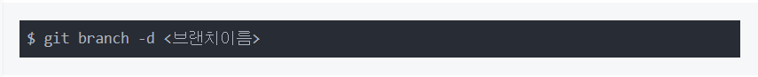

    - -d 옵션은 병합을 완료한 브랜치만 삭제 할 수 있음
    - -D 옵션은 병합을 완료하지 않은 브랜치를 삭제 할 수 있음.

## 충돌

- 8.5.1 충돌이 생기는 상황
    - 대부분 충돌 원인은 같은 위치의 코드를 동시에 수정했기 때문.

같은 파일의 동일한 위치의 코드를 각각 수정하고 커밋.

병합 시도
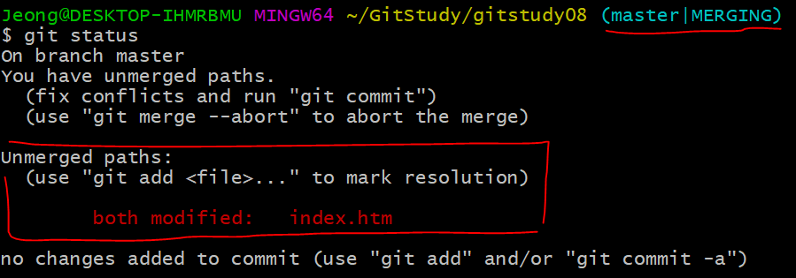
 - 충돌 사항이 표시됩니다.
 - 충돌이 발생한 파일 확인
 - 병합 충돌이 발생하면 자동으로 커밋이 생성되지 않음.

 병합 충돌은 피할 수 없지만, 예방은 가능
 1.팀원간 규칙을 정하고 상의하면서 개발하면 충돌을 줄일 수 있음
 2.master 브랜치 내용을 자주 자신의 브랜치로 병합,
   자신의 브랜치 상태가 최신일 수록 병합 시 충돌을 최소화 할수 있음.

- 8.5.2 수동으로 충돌 해결
    - 병합 충돌이 발생하면 수동으로 해결 해야 함.
    - 깃은 충돌 발생 시, 충돌된 코드 내용을 기호와 함께 표시
    - 
    - 
    - 충돌 내용을 수정할 때는 깃에서 표시한 기호도 함께 삭제해야 함
    - 충돌을 해결한 후 병합 커밋을 직접 만들어야 함.
    - 병합 커밋을 생성하면 깃의 충돌 마크는 자동으로 없어짐.
    - 

## 브랜치 병합 여부 확인

- 브랜치를 병합한 후에 바로 병합된 브랜치를 삭제하면 혼동을 줄일 수 있음.
- 깃은 병합한 브랜치와 병합하지 않은 브랜치를 구분하는 옵션을 제공.
    - 
    - 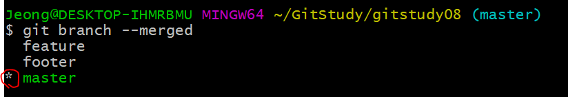
    - 병합하지 않은 브랜치 확인
    - 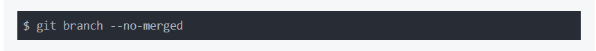

## 리베이스

브랜치를 합치는 방법은, 병합과 리베이스가 있음
리베이스는 커밋의 트리 구조를 재배열 함.

- 8.7.1 베이스

    - 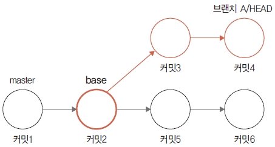
    - 브랜치는 커밋 하나를 기준으로 새로운 작업을 진행할 수 있는 분리된 경로를 의미.
    - 그림처럼 새로운 브랜치가 파생되는 커밋2를 베이스 라고 함.
    - 병합에서는 공통 조상 커밋이라고 함.

- 8.7.2 베이스 변경

    - 리베이스(rebase)는 파생된 브랜치의 기준이 되는 베이스 커밋을 변경하는 것.
    - 리베이스를 하면 복잡한 브랜치의 수많은 경로를 하나의 경로처럼 만듦.
    - 진행상황 파악에 용이
    - 

- 8.7.3 리베이스 vs 병합

    - 병합
        - 병합은 공통 조상 커밋부터 두 브랜치를 순차적으로, 커밋을 비교하면서 최종 커밋을 생성.

    - 리베이스
        - 두 브랜치를 서로 비교하지 않고 순차적으로 커밋 병합을 시도 함.
        - 순서
            1. 리베이스를 하면 먼저 공통 조상 커밋을 찾아 이동.(커밋2)
            2. 그 커밋부터 파생된 브랜치가 가리키는 커밋까지 diff를 임시 공간에 저장.(커밋 3,4)
            3. 리베이스 할 브랜치가 합칠 브랜치가 가리키는 커밋을 가리키게 함.
            4. 저장한 diff의 내용을 차례대로 적용.
            - 
            - 
            차이점
             - 3-way 병합은 병합 커밋이 있지만, 리베이스를 하면 병합 커밋이 없음.
             - 브랜치의 마지막을 가리키는 커밋위치가 다름.
                - master 브랜치는 커밋6을, A브랜치는 커밋4를 가리킴.

- 8.7.4 리베이스 명령어

    - 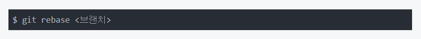

- 8.7.5 리베이스 병합

    - 리베이스는 merge 명령어와 기준 브랜치가 반대.
    - 
    - merge는 원본 브랜치에서 파생 브랜치를 읽어 옴.
    - 
    - rebase는 파생 브랜치에서 원본 브랜치를 읽어 옴.

- 8.7.6 리베이스되었는지 확인
    - 
    - 그림과 같이 진행된 커밋 내역들이 있을 때
    - description 브랜치에서 master로 rebase를 진행하면
    - 
    - 베이스 커밋을 변경하는 과정에서 커밋들은 재배치 됨.
    - description 커밋의 해시 값이 변경 됨.

- 8.7.7 리베이스 후 브랜치
    - 리베이스는 커밋 위치를 재조정 할 뿐 브랜치의 HEAD 포인터를 옮겨 주지는 않음.
    - 
    - master 브랜치 기준으로 생각하면
        - master 브랜치는 추가 커밋이 없는 상태
        - 리베이스한 브랜치에만 커밋이 진행된 것처럼 보임

    - 즉, 리베이스된 브랜치를 병합하면 Fast-Forward 방식으로 병합 함.
    - 
    - 리베이스를 하게 되면 복잡한 트리 모양의 구조가 선형 구조로 브랜치를 병경할 수 있음
    
- 8.7.8 리베이스 충돌과 해결
    - 리베이스 충돌 또한 수동으로 해결해야 함
    - 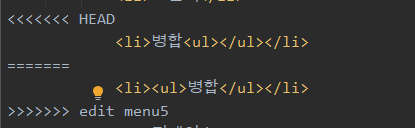
    - 병합과 동일하게 충돌 기호가 표시 됨
    - 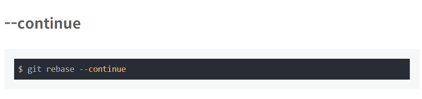
    - 리베이스는 충돌된 부분을 한 단계씩 해결해 나가면서 병합 할 수 있음.
    - 수정 한 파일은 스체이지 상태에서 내려가기 때문ㅇ 다시 올려줘야 함.
    - 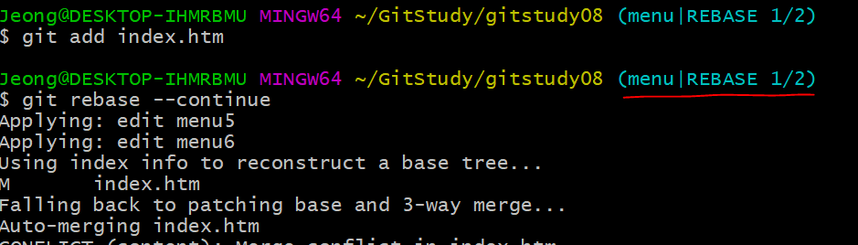
    - 모든 충돌을 해결하면 리베이스 작업이 종료
        - 이후엔 브랜치를 이동하여 merge 한 뒤, 브랜치를 정리
    
    - 리베이스를 취소하고 싶으면, --abort 옵션을 사용. $git rebase --abort

- 8.7.9 rebase 명령어로 커밋 수정

    - 마지막 커밋은 --amend 로 커밋 메시지를 수정 할 수 있음.
    - 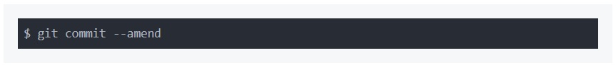
    - 리베이스는 실제 병합은 아니지만 커밋 위치를 재조정하여 병합과 유사한 효과를 냄.
    - 리베이스는 커밋을 재조정하는 것 외에도 여러 커밋을 한 커밋으로 묶을 수 있음.
    - 

    - 
    - pick 을 이용해서 커밋 순서를 바꿀수도 있고, 커밋 해시값을 이용해 특정 커밋을 가져올 수도 있음.
    - reword 는 커밋 메시지를 변경하는 명령어
    - edit 은 커밋 메시지 뿐만 아니라 커밋의 작업 내용도 변경 가능
    - squash 는 해당 커밋을 이전 커밋과 합치는 명령어

    squash 를 이용하여 commit 을 합쳐준 모습.
    befor
    - 
    after
    - 

- 8.7.10 리베이스할 때 주의할 점
    
    - 리베이스는 커밋 위치와 해시 값을 변경.
    - 저장소를 외부에 공개했다면, 공개된 순간부터 커밋은 리베이스를 사용하지 않는 것을 원칙
    - 외부의 공개된 커밋을 리베이스하면 커밋 위치와 해시 값이 변경되어 혼란.
    - 공개된 커밋을 변경 할 땐 revert 명령어를 사용
