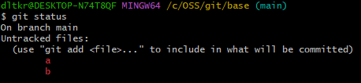
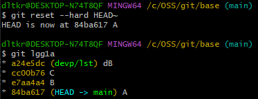
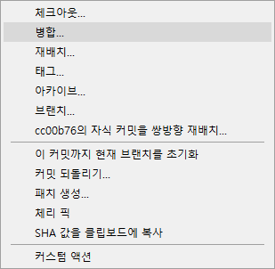

# 2022 OSS 수요일 오전반 6조 

## 팀 과제 : Git 교과서 9장 정리하기


  
<center></center>


## 9장 복귀
1. [되돌리기](#되돌리기)
2. [리셋](#리셋)
3. [리버트](#리버트)
4. [정리](#정리)

## 되돌리기

- 깃을 이용하여 버전을 관리하는 목적은 만일의 사태를 대비하기 위해서입니다. 프로그래밍은 수많은 코드를 작성하고 테스트하는 과정입니다. 개발자는 코드를 단계별로 발전시키면서 실수를 최소화하고자 노력합니다. 하지만 아무리 주의해서 프로그래밍해도 오류가 생깁니다. 개발 도중에 심각할 정도로 오작동해서 더 이상 개선하기 어려울 때도 생기곤 합니다. 이때는 문제를 억지로 해결하려고 노력하는 것보다 지금까지 한 작업을 포기하고 다시 시작하는 것이 좀 더 빠르게 해결할 수 있는 방법이 될 수도 있습니다.
깃을 사용하면 언제든지 원하는 시점으로 전체 코드를 되돌릴 수 있습니다. 마치 코드 복구 시스템과 같습니다.

- 9.1.1 다시 시작

    - 모든 수정 내역을 일일이 기억하여 과거 상태로 되돌아가는 것은 쉽지 않습니다. 이때 깃을 사용하면 좀 더 손쉽게 되돌아갈 수 있습니다.

    - 깃은 기록된 커밋을 기준으로 이전 상태로 되돌릴 수 있습니다. 즉, 코드를 항상 안정적으로 유지하고 관리할 수 있게 해 주는 도구입니다. 수많은 개발자가 깃을 사랑하는 이유 중 하나이기도 합니다.

    - 깃에서 코드 작업을 되돌리는 방법은 크게 reset과 revert 두 가지입니다. 


## 리셋
- 리셋(reset)은 커밋을 기준으로 이전 코드로 되돌리는 방법으로, 기록한 커밋을 취소합니다. 커밋을 취소하는 만큼 리셋할 때는 항상 신중하게 작업해야 합니다.

- 9.2.1 복귀 시점
    - 복귀는 어떤 시점으로 돌아가는 것을 의미합니다. 따라서 이전 코드로 복귀하려면 복귀 시점을 알려 주어야 합니다. 리셋은 이 시점을 커밋을 기준으로 정합니다. 커밋은 log 명령어로 조회할 수 있습니다. log 명령어를 실행하면 커밋의 해시 값과 메시지를 출력합니다. 따라서 복귀하고자 하는 특정 시점을 찾는 데 매우 유용합니다.
    
      –oneline 옵션을 같이 사용하여 로그 기록을 확인합니다. 간략한 커밋 해시 값과 메시지가 같이 출력됩니다.
        ```
        $ git log -oneline
        ```
      커밋 메시지는 특정 시점을 파악하는 데 매우 좋습니다. 커밋 메시지는 여러 줄로 작성할 수 있으며, 로그 기록은 그중 첫 번째 줄 메시지만 출력합니다. 그래서 커밋 메시지를 작성할 때는 첫 번째 줄에 요약 정보를 입력합니다. 한 줄을 띄우고 좀 더 상세한 내용을 작성하면 좋습니다.

      고정된 커밋 해시 값을 사용하지 않고, HEAD 포인터를 이용하여 상대적 위치를 지정할 수도 있습니다. 다음과 같이 캐럿(^) 또는 물결(~) 기호를 사용하여 HEAD의 상대 커밋 위치를 지정합니다.
    ```
        $ git reset –hard HEAD^^^
    ```

- 9.2.2 reset 명령어
  - reset 명령어를 사용하면 지정된 커밋 코드로 되돌아갑니다. 즉, 특정 커밋의 해시 값 상태로 모든 코드를 복구합니다.
  reset 명령어는 옵션을 함께 사용해야 하며, 세 가지 옵션이 있습니다.
  ```
    $ git reset 옵션 커밋ID
  ```
  - soft : 스테이지 영역을 포함한 상태로 복원합니다.  
  
  - mixed: 기본 옵션 값은 mixed입니다. reset 명령어를 사용할 때 옵션을 지정하지 않으면 기본값인 mixed로 선택됩니다.
  
  - hard: 실제 파일이 삭제된 이전 상태로 복원합니다.

- 9.2.3 soft 옵션
    - soft 옵션은 가장 낮은 단계의 리셋 동작입니다. 
        ```
        $ git reset --soft HEAD~
        ```  
        soft 옵션은 지정한 커밋 위치로 복귀합니다. 복귀하면서 스테이지 영역의 상태도 같이 복귀합니다. soft 옵션은 파일을 수정하고, add 명령어로 스테이지 영역에 올려 커밋을 실행하기 직전의 단계로 되돌립니다. add 명령어를 사용하지 않고도 바로 커밋할 수 있는 
        직전의 상황입니다.

    - soft 옵션은 단순히 HEAD 위치를 이동하는 역할만 합니다. 마치 직전의 커밋 단계로 체크아웃하라는 명령과 유사합니다. reset --soft 명령어와 체크아웃 명령어는 HEAD 위치를 이동한다는 점에서는 동일하지만, 브랜치를 변경하지 않는다는 점에서 차이가 있습니다.
    <center></center>
    <center></center>

- 9.2.4 mixed 옵션
    - reset 명령어의 기본값은 mixed 옵션입니다.
    ```
      $ git reset –mixed 커밋ID
    ```
    - 또는 다음과 같이 mixed 옵션을 생략할 수 있습니다.
    ```
      $ git reset 커밋ID 생략 가능
    ```
    <center></center>
    - mixed 옵션은 soft 옵션과 달리 리셋한 후 스테이지 상태까지 복원하지 않습니다.
    때문에 Unstaged 상태가 되어 메시지가 빨간색으로 표시됩니다. 
    <center></center>
    - 스테이지 영역을 같이 복사하지 않기 때문에 수정된 파일은 스테이지 영역이 아닌 워킹 디렉터리 안에 남아 있습니다. 따라서 mixed 옵션을 사용하여 리셋한 후 다시 커밋하려면 반드시 add 명령어를 실행해야 합니다.

- 9.2.5 hard 옵션
    - soft 옵션과 mixed 옵션은 이전 커밋으로 되돌리는 과정에서 실제로 삭제되는 내용은 없습니다. 모든 작업 내용이 워킹 디렉터리에 그대로 유지됩니다. 정확히 말하면 이전 상태로 되돌아가는 것이 아닙니다. 복귀 커밋 이후의 작업들은 워킹 디렉터리 영역에 남겨 두어 다시 수정하거나 커밋할 수 있도록 상태만 변경하는 것입니다.
    
    - 이에 반해  hard 옵션은 리셋되는 복귀 시점의 커밋 상태와 해당 커밋의 워킹 디렉터리까지 모두 되돌립니다. 즉, reset 
     --hard 명령어를 사용한 커밋 이후의 모든 내용은 삭제됩니다. 
     <center></center>   
       

- 9.2.6 소스트리

    - 리셋하려면 복귀 시점의 커밋 해시 값이 필요합니다. 하지만 매번 로그를 검색하여 리셋하는 것은 불편합니다. 소스트리를 이용하면 더 쉽게 리셋할 수 있습니다.
    
    - 먼저 소스트리의 커밋 그래프에서 복귀할 커밋을 선택합니다. 그리고 마우스 오른쪽 버튼을 눌러 이 커밋까지 현재 브랜치를 초기화 메뉴를 선택합니다.
    <center></center>  
    <center></center> 
    <center></center> 

- 9.2.7 커밋 합치기
    - 앞에서는 리베이스 병합의 -i 옵션을 사용하면 여러 커밋을 하나로 합치는 동작을 수행할 수 있었습니다. 또 단일 커밋은 커밋 명령어의 –amend 옵션으로 커밋을 수정할 수 있었습니다. 리셋의 동작 원리를 이해하고 있다면, 커밋도 수정할 수 있습니다. 리셋의 soft 옵션은 HEAD를 해당 커밋으로 이동합니다. 그리고 원본 내용은 그대로 워킹 디렉터리에 남겨 둡니다.    
        ``` 
        $ git reset -–soft HEAD~2  
        $ git commit -am “B,C”
        ```
    - 이처럼 reset --soft를 통해 HEAD를 옮긴 뒤 commit하면 앞의 2개의 commit이 1개의 커밋으로 합쳐집니다. 

- 9.2.8 스테이지 리셋
    - 스테이지 영역은 커밋을 하려고 임시로 결과물을 보관해 두는 공간입니다. 커밋을 하려면 워킹 디렉터리에서 작업한 내용을 스테이지 영역에 등록해야 합니다. 앞에서 배웠듯이, 스테이지 영역에 등록할 때는 add 명령어를 사용합니다.
    ```
      $ git add 파일이름
    ```

    - add 명령어로 등록된 스테이지 영역의 파일을 다시 unstage 상태가 되도록 스테이징을 취소할 수 있습니다. 스테이지 영역에서 등록된 파일을 다시 unstage 상태로 만들 때는 reset 명령어를 사용합니다. 아래 세 명령어는 같습니다.
    ```
      $ git reset 파일이름
      $ git reset 커밋ID 파일이름
      $ git reset –mixed HEAD 파일이름
    ```

- 9.2.9 작업 취소
    - 코드를 수정하는 도중 오류가 생겨 현재 작업을 모두 취소하고 싶을 수 있습니다. 보통은 다음과 같이 워킹 디렉터리에서 코드를 수정하고, 수정한 코드는 다시 스테이지 영역에 등록합니다.
    
    - 수정 작업을 완전히 취소하려면 워킹 디렉터리와 스테이지 상태를 모두 제거하여 마지막 커밋 상태로 되돌려 놓아야 합니다. 그림을 보면 HEAD 포인터는 가장 마지막의 커밋 위치를 가리킵니다. 그리고 수정 작업들은 모두 워킹 디렉터리 안에 남아 있습니다. 리셋할 때의 시점을 현재 HEAD를 기준으로 하면 해당 시점의 수정 작업을 모두 삭제할 수 있습니다.
    ```
     $ git reset –hard HEAD
    ```

- 9.2.10 병합 취소  
    - 리셋은 병합된 브랜치도 취소할 수 있습니다.
    ```
      $ git reset –merge HEAD~
    ```

## 리버트

- 깃은 커밋의 버전을 되돌릴 수 있는 또 다른 방법인 리버트를 제공합니다. 리버트와 리셋 차이점은 커밋 정보 삭제 여부입니다

- 9.3.1 취소 커밋
  - 리버트는 기존 커밋을 남겨 두고 취소에 대한 새로운 커밋을 생성합니다. 취소 커밋을 생성할 때는 revert 명령어를 사용합니다. 취소 커밋은 지정한 커밋을 삭제하지 않습니다. 그 대신 삭제를 위한 새로운 커밋을 생성합니다. 현재 커밋을 리버트하는 명령어입니다.
    ```
    $ git revert HEAD
    ```
    <center></center> 

- 9.3.2 리버트 지정
  - 리버트는 한 번에 커밋 하나만 취소할 수 있습니다. 따라서 여러 커밋을 리버트하려면 최신 커밋부터 순차적으로 취소해야 합니다.
  - 직전의 커밋이 아닌 다른 커밋을 취소할 때는 커밋 해시 값을 지정합니다.
    ```
    $ git revert 커밋ID
    ```
  - 깃의 범위 지정 연산자를 사용하여 여러 커밋을 리버트할 수도 있습니다. 연산자 ..를 같이 사용합니다.
    ```
    $ git revert 커밋ID .. 커밋ID
    ```

- 9.3.3 소스트리에서 리버트
  - 소스트리에서 리버트하는 방법은 간단합니다. 해당 커밋을 선택한 후 마우스 오른쪽 버튼을 누릅니다. 그리고 커밋 되돌리기 메뉴를 선택합니다.
  <center></center>
  <center></center>

- 9.3.4 병합 취소
  - 리버트를 이용하여 병합한 커밋을 취소할 수 있습니다. 리셋은 방금 전 실행한 병합만 삭제합니다. 하지만 리버트는 시간이 지난 후에도 과거의 병합을 선택하여 취소할 수 있습니다.
  - 리버트로 병합을 취소할 때는 --mainline 옵션을 같이 사용할 수 있습니다.
    ```
    $ git revert --mainline 숫자 병합커밋ID
    ```
  - 병합은 두 브랜치가 결합된 형태입니다. 리버트로 병합이 취소 상태가 되면 둘 중 한 브랜치로 체크아웃해야 합니다. --mainline 옵션은 병합을 취소한 후 체크아웃되는 브랜치를 표시합니다. --mainline은 체크아웃으로 되돌아가는 커밋 번호입니다.
  - 리베이스된 병합은 리버트하기 어렵습니다. 리베이스로 병합된 공통 조상 커밋을 찾기 어렵기 때문입니다.

- 9.3.5 리버트 히스토리
  - 리버트를 실행하면 새 커밋이 추가되기 때문에 커밋 이력이 복잡합니다. 어떻게 보면 리셋으로 간단하게 이전 상태로 되돌리는 것이 간편해 보일 수도 있습니다. 하지만 저장소를 공개했다면 리셋으로 커밋을 삭제하는 것은 협업 차원에서 위험합니다. 이때는 리버트가 유용합니다.

## 정리

- 리셋과 리버트는 버전 관리의 특성을 그대로 보여 주는 기능입니다. 리셋과 리버트는 동작을 취소하고 과거로 돌아간다는 면에서는 유사합니다. 코드 변경 이력을 저장하고 필요한 시점에 해당 코드 상태로 쉽게 이동할 수 있습니다.
하지만 이렇게 두 명령어로 분리하여 사용하는 것은 저장소를 원격 저장소로 공유했는지 여부와 관련이 있습니다. 자신의 저장소를 외부로 공유했다면 특정 커밋을 삭제하는 것은 위험합니다. 다수의 사용자와 공유하는 저장소의 커밋 기록이 깨질 수 있기 때문입니다. 외부로 공개한 저장소라면 리버트를 사용하는 것이 좋습니다. 자신의 저장소가 컴퓨터에만 있다면 리셋을 사용해도 됩니다.