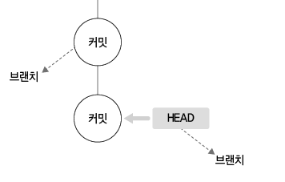
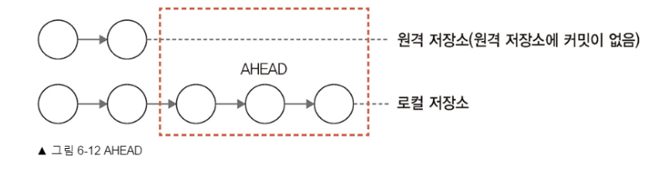
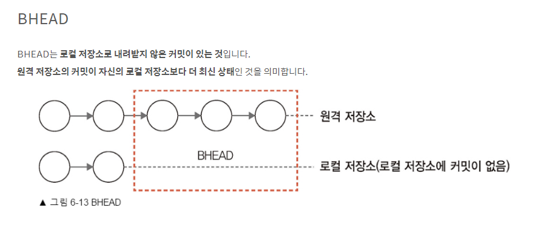

#  2022 OSS 수요일 오전반 6조

## 팀 과제 : Git 교과서 브랜치 6장 요약

## 6장 서버
1. [새로운 작업](#새로운-작업)
2. [브랜치 생성](#브랜치-생성)
3. [브랜치 확인](#브랜치-확인)
4. [브랜치 이동](#브랜치-이동)
5. [브랜치 공간](#브랜치-공간)

## 새로운 작업

브랜치 : 저장공간에서 가상의 또 다른 저장공간을 만들어 프로젝트를 독립적으로 관리하는데 사용함.

- 6.1.1 브랜치 작업
   - 브랜치는 프로젝트를 독립적으로 관리하는데 사용합니다.
     개발자는 항상 안정된 코드 상태를 유지하고, 개발 중인 작업과 구분하여 관리해야 합니다.

- 6.1.2 깃 브랜치 특징
   -  가상폴더
     - 기존 폴더를 복제하는 것과 다르게 가상폴더를 생성하여야합니다.
       git init시 master브랜치가 자동생성됩니다.
       branch 명령어를 통해 현재 브랜치를 확인할 수 있습니다.
       $ git branch
       * master

   -  독립적인 동작.
     - 브랜치를 이용하면 원본 폴더와 독립적으로 개발할 수 있습니다.
       분리된 브랜치에서 소스 코드를 각자 수정한 후 원본 코드에 병합하는 명령만 실행하면 됩니다.

   -  빠른 동작
     - 다른 VCS들은 브랜치를 생성할 때 내부 파일 전체를 복사합니다.
       파일 크기가 매우크다면 생성하는데 시간이 오래걸립니다.
       깃은 브랜치를 변경할 때 포인터를 이동하여 빠르게 전환합니다.
       브랜치 명령을 사용하면 내부적으로 커밋을 하나 생성하여 브랜치로 할당합니다.

## 브랜치 생성

브랜치를 생성하기 위해선 기준이 되는 브랜치 또는 커밋이 하나 있어야합니다.
브랜치는 독립된 공간을 할당받고, 기본 브랜치의 소스코드에 영향을 주지 않고 새로운 작업을 할 수 있습니다.

- 6.2.1 브랜치 생성
   - brabch 명령어를 이용해 기본 제공되는 master 이외의 브랜치를 생성할 수 있습니다.

     $ git branch 생성할브랜치이름 커밋ID

   - 브랜치 이름만 입력하면 현재 HEAD를 기준으로 새로운 브랜치를 생성하고, 커밋 ID를 입력하면
     해당 커밋을 기준으로 브랜치를 생성합니다.

       

- 6.2.2 브랜치 이름
   - 사전 예약된 이름은 없지만 작업을 알기 쉬운 이름으로 짓는게 좋습니다.

   - /를 이용하여 계층적 구조로 만들 수 있음.
     기호(-), 마침표(.)로 시작할 수 없음
     연속마침표(..),빈칸,공백문자,~, \^, \? *, []를 포함할 수 없음.

## 브랜치 확인

- 6.3.1 브랜치 목록 확인
   - branch명령어로 브랜치의 목록을 확인할 수 있습니다.
     현재 브랜치 앞에는 *표시가 붙습니다.

- 6.3.2 브랜치 해시
   - rev-parse명령어를 통해 현재 브랜치가 어떤 커밋의 해시값을 가리키는지 확인할 수 있습니다.
     
     $ git rev-parse 브랜치이름

- 6.3.3 브랜치 세부 사항 확인
   - branch명령어에 -v 혹은 -verbose 옵션을 사용하면 브랜치의 이름, 커밋 ID, 커밋메시지를 볼 수
     있습니다.

     $ git branch -v
     * feature d84766c first
     footer d84766c first
     master d84766c first

## 브랜치 이동

- 6.5.1 체크아웃
   - checkout명령어를 이용해 브랜치간을 이동할 수 있습니다.

     $ git checkout 브랜치이름
   - 주의 : 깃은 하나의 워킹디렉토리만 가지므로,
     한 브랜치에서만 작업과 커밋을 할 수 있어 다른 브랜치에서 작업하려면 반드시 브랜치를 변경하여 워킹디렉토리를 재설정해야합니다.
     또 커밋하지 않은 수정사항이 있을 경우 브랜치를 변경할 수 없습니다.

    - checkout명령어는 브랜치 이외에도 특정 파일이나 커밋으로 이동할 수 있습니다
     $ git checkout 브랜치이름
     $ git checkout -- 파일이름 

    - 이중대시(--)를 사용하면 파일이름을 정확히 지정하여 브랜치를 변경할 수 있습니다. 이렇게하면
      깃의 다른 옵션 명령어와 혼동하지 않습니다.

- 6.5.2 브랜치의 동작 원리
   - HEAD는 항상 변경된 브랜치의 마지막 커밋을 가리킵니다.
     브랜치 변경 시 새로운 작업을 할 수 있도록 워킹디렉토리가 변경됩니다.

- 6.5.3 이전 브랜치
   - $ git checkout -
     -를 입력하면 직전 브랜치로 이동할 수 있습니다.

- 6.5.4 워킹 디렉토리 정리
   - 브랜치 이동 시 워킹디렉토리가 정리되지 않았을 경우 에러가 발생합니다.

## 브랜치 공간

- 6.6.1 브랜치 로그
   - 브랜치의 흐름을 확인하기 위해
     git log에 --gragh 옵션을 추가합니다. --all 옵션을 사용하면 모든 로그를 출력합니다.

     $git log --graph --all
     
     --more 옵션으로 출려될 커밋 개수를 제한할 수 있습니다.

     & git show-branch --more=10

- 6.6.2 브랜치 소스 확인
   - 브랜치를 이동하면 각자 브랜치의 마지막 워킹 디렉터리 상태로 빠르게 변경됩니다.

## HEAD 포인터

   - 깃은 객체 포인터 개념을 사용합니다.(HEAD)

- 6.7.1 마지막 커밋
   - HEAD는 작업 중인 브랜치의 마지막 커밋ID를 가리키는 참조 포인터 입니다.

- 6.7.2 브랜치 HEAD
   - 브랜치를 이동하면 HEAD 포인터도 이동됩니다.
     브랜치 마다 마지막 커밋 ID를 가리티는 HEAD 포인터가 하나씩 있습니다.

- 6.7.4 상대적 위치
   - HEAD를 기준으로 상대적 커밋 위치도 지정할 수 있습니다.
     상대적 커밋 위치를 지정할 때는 캐럿(^)과 물결(~) 기호를 사용합니다.
     ^과~ 기호는 각각 하나의 상대적 위치를 의미합니다.
     ex) HEAD 기준으로 이전 3개 위치 지정 → HEAD^^^ or HEAD

- 6.7.5 AHEAD, BHEAD
   - 원격 저장소와 연동하여 깃을 관리하면 블내치마다 HEAD가 2개 있습니다.
     원격 저장소의 HEAD와 로컬 저장소의 HEAD 입니다.
     이 두 저장소의 마지막 커밋 위치는 일치하지 않을 수 있습니다.
     AHEAD 와 BHEAD는 서로 다른 저장소 간 HEAD 포인터의 위치 차이를 의미합니다.

   - AHEAD

     AHEAD는 서버로 전송되지 않은 로컬 커밋이 있는 것입니다.
     즉, 로컬 저장소의 HEAD 포인터를 기준으로 로컬 브랜치에 있는 커밋이 서버의 커밋 개수보다 많은 경우 입니다.
      

   - BHEAD

     BHEAD는 로컬 저장소로 내려받지 않은 커밋이 있는 것입니다.
     원격 저장소의 커밋이 자신의 로컬 저장소보다 더 최신 상태인 것을 의미합니다.
     

## 생성과 이동
    
   - 브랜치를 생성하는 동작와 이동하는 동작은 별개입니다.
     생성은 branch 명령어를, 이동은 checkout 명령어를 사용합니다.

- 6.8.1 자동 이동 옵션
   - checkout 을 할 때 -b 옵션을 이용하여 생성과 이동을 동시에 할 수 있습니다.

     $ git checkout -b 브랜치이름

- 6.8.2 커밋 이동
   - 브랜치 이름 대신 커밋 해시키를 사용하여 체크아웃할 수도 있습니다.

     $ git checkout 커밋해시키

- 6.8.3 HEAD를 활용한 이동
   - HEAD포인터를 사용하여 체크아웃 할 수도 있습니다.

     $ git checkout HEAD~<숫자> ---- 숫자만큼 HEAD의 이전 커밋으로 체크아웃

- 6.8.4 돌아오기
   - 간단하게 다시 돌아오는 방법은 대시(-)를 사용하는 것입니다.

     $ git checkout -

     커밋 단계를 여러 번 이동했을 경우, 대시(-) 명령어를 여러번 실행해야 합니다.
     그럴땐 그냥 직접 브랜치 이름을 입력하는 것이 편합니다.

## 원격 브랜치

 - 6.9.1 리모트 브랜치
   - 원격 저장소에 생성한 브랜치를 리모트 브랜치라고 합니다.
     로컬 저장소에서 만든 브랜치나, 원격 저장소에 등록된 브랜치가 자동으로 서로의 브랜치에 반영되지는 않습니다.
     별도 명령어를 통해 동기화해야 합니다.

 - 6.9.3 브랜치 추적
   - 리모트 브랜치는 원격 저장소의 브랜치를 가리키는 포인터입니다.
     원격 저장소의 브랜치를 가리키는 것을 브랜치 추적(또는 트래킹 브랜치)이라고 합니다.
     추적 브랜치는 원격 브랜치의 마지막 커밋 해시 값을 가리킵니다.
     이 포인터 정보는 .git/refs 폴더 안에 있습니다.
     로컬 저장소는 마지막으로 연결된 리모트 브랜치의 커밋 해시 값을 항상 가지고 있습니다.
    
- 6.9.4 브랜치 업로드
   - 등록된 원격 저장소의 리모트 브랜치는 remote show 명령어로 확인할 수 있습니다.

     $ git remote show 원격브랜치

     리모트 브랜치는 서버간에 통신을 하고 나서 생성됩니다.
     로컬 저장소의 브랜치를 원격 저장소에 동기화하려면 푸시 작업을 해야 합니다.

     $ git push 원격저장소별칭 브랜치이름

     원격 저장소를 확인해 보면 지정한 브랜치만 생성되는것을 알 수 있습니다.

- 6.9.5 이름이 다른 브랜치
   - 일반적으로 로컬 저장소와 원격 저장소의 브랜치 이름은 동일하게 사용합니다.
     하지만 다른 개발자가 만든 브랜치 이름과 똑같을 경우 중돌이 발생하게됩니다.
     깃은 서로 다른 로컬 브랜치와 리모트 브랜치를 수동으로 지정하여 연결할 수 있습니다.
     콜론(:)으로 구분합니다.

     $ git push origin 브랜치이름:새로운브랜치   ---- 새로운브랜치가 원격저장소에 보내집니다.

- 6.9.6 업스트림 트래킹
   - 업스트림(upstream)은 브랜치 추적을 다르게 표현한 것입니다.
     리모트 브랜치는 브랜치 이름을 동일하게, 또는 다르게 생성할 수 있습니다.
     이런 로컬 저장소의 브랜치와 원격 저장소의 브랜치는 서로 매칭되어 있습니다.
     이러한 매칭을 업스트림 트래킹이라고 합니다.

     

     $ git clone <원격저장소주소> <폴더이름> --- 폴더이름으로 새 폴더를 생성하여 clone합니다.

     -r 옵션을 사용하여 원격 저장소의 리모트 브랜치 목록을 확인할 수 있습니다.

     $ git branch -r ----- -a옵션은 모든 브랜치

     복제 저장소의 트래킹 브랜치를 확인하려면 -vv 옵션을 사용합니다.

     $ git branch -vv

     * 굳이 불필요한 브랜치를 한 번에 다 가져오는 것은 비효율 적입니다.

        - 6.9.7 업스트림 트래팅 확인
           - 복제된 저장소에서 새로운 업스트림 만들기(function 브랜치)

           $ git checkout --track origin/<브랜치이름>   ----- 원격 저장소의 브랜치이름 그대로 가져와서 체크아웃

           function 브랜치에서 코드 수정
           커밋 (AHEAD 1개 확인 가능. 로컬 저장소의 커밋이 더 최신이므로)
           깃으로 푸시 (로컬 저장소를 원격 저장소의 function 동기화)
           원본 저장소의 feature 브랜치로 이동.
           pull (원격 저장소의 function 브랜치와 로컬 저장소의 feature 브랜치가 업스트림 트래킹을 확인.)

- 6.9.7 원격 브랜치 복사
   - 원격 저장소의 리모트 브랜치를 이용해서 로컬 저장소에도 새로운 브랜치를 생성하여 동기화
     
     $ git checkout -b <새이름> origin/<브랜치이름> --- -b옵션은 생성 후 이동.

- 6.9.8 업스트림 연결
   - 기존에 있는 브랜치를 업스트림으로 직접 설정할 수도 있습니다.

     $ git branch -u origin/브랜치이름

     -u는 —set-upstream-to 의 약자 입니다. 기존 브랜치를 특정 원격 브랜치로 추적합니다.

## 브랜치 전송

- 6.10.1 브랜치 푸시
   - 처음으로 로컬 저장소에 새로운 원격 저장소가 등록되면 push 명령어를 사용할 때 오류가 출력됩니다.
     처음에는 커밋과 브랜치를 푸시하는데 업스트림 설정이 필요합니다.

     $ git push --set-upstream origin master

- 6.10.2 브랜치 패치
   - 일반적인 커밋 페치와 동일합니다.
     로컬 저장소에 새로운 브랜치가 생성되지는 않습니다. 원격 저장소에서 리모트 브랜치 내용을 내려받기만 할 뿐 자동으로 병합하지 않기 때문입니다.
     원격 저장소에서 페치된 커밋들은 새로운 로컬 브랜치로 반영하려면 병합 명령을 실행해야 합니다.

     $ git merge 원격저장소별칭/브랜치이름

     병합하지 않고 테스트만 하고 싶을 때는, 원격 브랜치의 포인터를 사용하여 임시 브랜치를 생성하거나 직접 체크아웃할 수 있습니다.

     $ git checkout -b 임시브랜치이름 origin/브랜치이름

## 브랜치 삭제
   - 브랜치를 삭제하는 것은 해당 브랜치 내용과 커밋을 모두 삭제하는 것입니다.
     그리고 현재 자신이 있는 브랜치는 삭제할 수 없습니다. 다른 브랜치로 잠시 이동해야 합니다.

- 6.11.1 일반적인 삭제 방법

   - $ git branch -d 브랜치이름

     -d 옵션은 스테이지가 깨끗할 때만 삭제를 허용합니다.

- 6.11.2 강제로 삭제하는 방법
   - 워킹 디렉터리 또는 스테이지에 추가 커밋 작업이 남아있다면 강제로 삭제해야 합니다.

     $ git branch -D 브랜치이름

- 6.11.4 리모트 브랜치를 삭제하는 방법
   - 원격 저장소의 브랜치를 삭제하려면 먼저 삭제 명령을 푸시해야합니다.

     $ git push origin --delete 리모트브랜치이름

          

   